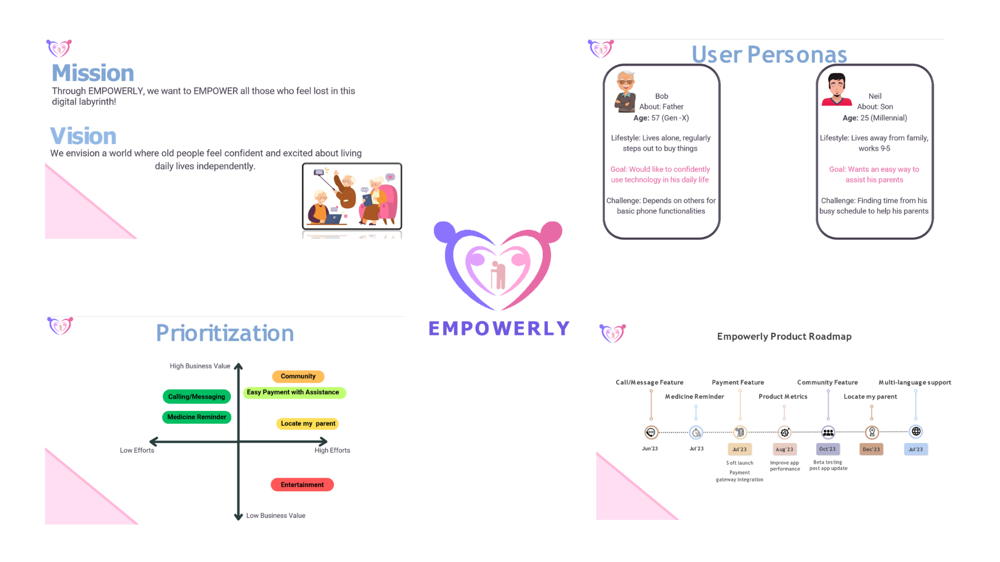

# Product Management Portfolio

Welcome to my product management portfolio! Here you'll find a collection of my projects focused on product breakdowns, adding new features, and exploring new product ideas.

## Project 1: Bumble-Presentation

In this project, my team and I worked on enhancing Bumble by adding new features to improve user experience and authenticity.

To view the full presentation, please refer to [Bumble-Presentation.pdf](Bumble-Presentation.pdf).

## Project 2: Empowerly

Empowerly is a new product idea aimed at creating a simplified UI payment app designed specifically for the elderly, empowering them through technology.

## Projects 3 & 4: Product Breakdowns - TikTok and Facebook

These projects involve detailed breakdowns of TikTok and Facebook, including feature analysis, demographics, and more.

