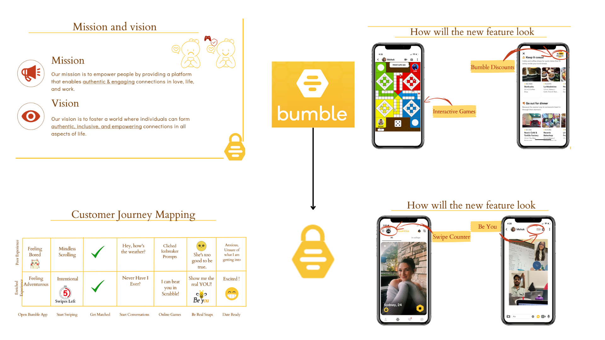

# Product_Management_Portfolio

-Here you'll find my product management projects.
There will be a mix of product breakdowns, adding new features, new product ideas etc.

Project 1:-
-You can start with the Bumble-Presentation. 
Here my team and I worked on adding new features to make it better and make the experience more authentic for the users.

To find the full presentation. Please go through the Bumble-Presentation.ppt

Project 2:-
-The second project is called Empowerly. This is a new product idea with a simplified UI payment app for the elderly. (Empowering the elderly = Empowerly)

Project 3 & 4:-
-These are the product breakdowns of Tiktok and Facebook. Feature breakdown, demography etc.

